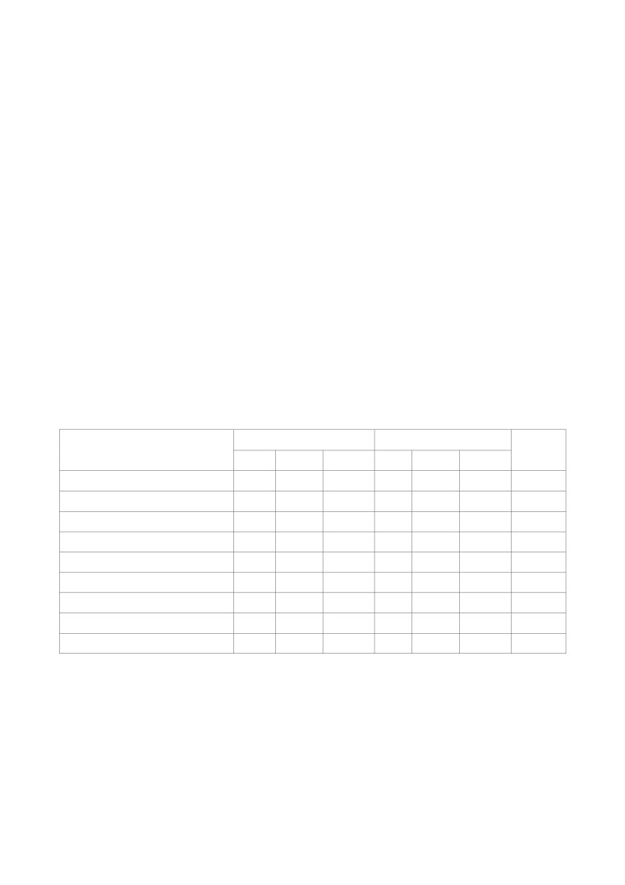

<html>
<head><meta http-equiv=Content-Type content="text/html; charset=UTF-8">

</head>
<body>

Report On Assignment-1

Classifier used:

Linear Regression, Logistic Regression, Random Forest Classifier, Decision Tree Classifier,

Gaussian Naive Bayes Classifier, Support Vector Machine Classifiers, K-Neighbors Classifier, Ada

Boost Classifier, Multi-layer Perception Classifier.

Feature Extracted:

Total 12 feature extracted from two fields. They are-

RPM  = Maximum positive sentiment score of words in “reviewText”

RPA

= Average positive sentiment score of words in “reviewText”

RNM  = Maximum negative sentiment score of words in “reviewText”

RNA   = Average negative sentiment score of words in “reviewText”

RNP

= Number of words having non-zero positive sentiment score in “reviewText”

RNN   = Number of words having non-zero negative sentiment score in “reviewText”

SPM

= Maximum positive sentiment score of words in “summary”

SPA

= Average positive sentiment score of words in “summary”

SNM  = Maximum negative sentiment score of words in “summary”

SNA

= Average negative sentiment score of words in “summary”

SNP

= Number of words having non-zero positive sentiment score in “summary”

SNN

= Number of words having non-zero negative sentiment score in “summary”

Evaluation Table:

Classifier Name

Training Data

Test Data

Detection

Time

Total

Correct

accuracy

Total

Correct

accuracy

Linear Regression

2200

1189

54.05%

944

503

53.28%

1.18s

Logistic Regression

2200

1571

71.41%

944

651

68.96%

1.32s

Random Forest Classifier

2200

1930

87.73%

944

811

85.91%

2.51s

Decision Tree Classifier

2200

1932

87.82%

944

810

85.81%

1.05s

Gaussian Naive Bayes Classifier

2200

1328

60.36%

944

545

57.73%

1.47s

Support Vector Machine Classifier

2200

1833

83.32%

944

774

81.99%

1.21s

K-Neighbors Classifier

2200

1905

86.59%

944

808

85.59%

3.74s

Ada Boost Classifier

2200

1555

70.68%

944

651

68.96%

1.99s

Multi-layer Perception Classifier

2200

1931

87.77%

944

811

85.91%

2.03s

Model Selection:

Decision Tree Classifier with an accuracy of 85.81% in test data set having the lowest runtime.

References:

[1]

Kumar, S., Zymbler, M. A machine learning approach to analyze customer satisfaction from

airline tweets. J Big Data 6, 62 (2019). <A HREF="https://doi.org/10.1186/s40537-019-0224-1/">https://doi.org/10.1186/s40537-019-0224-1</A> 

</body>
</html>
